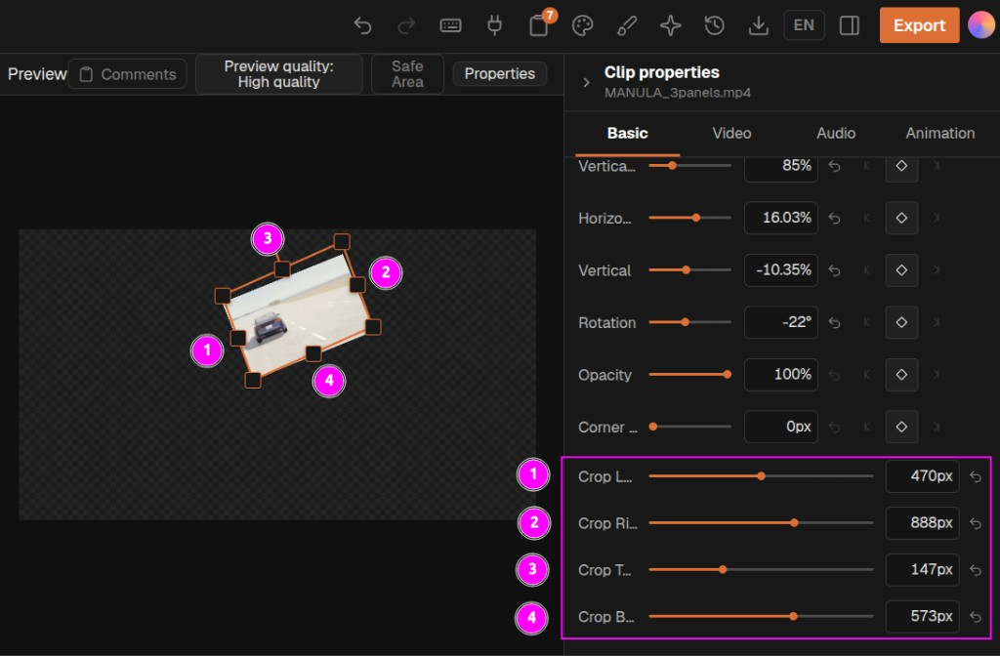

# Flex crop

Branch notes for **Crop Left / Right / Top / Bottom** on [OpenChatCut](https://github.com/0xsline/OpenChatCut). The product README stays on `main`. This file is only the crop feature.

Pull request: [0xsline/OpenChatCut#123](https://github.com/0xsline/OpenChatCut/pull/123)

Kdenlive-style **spatial** FlexCrop. Cropped pixels are fully transparent (checkerboard in the preview). This is not a timeline trim, not a mask, not ffmpeg, and not a motion graphic.

<p align="center">
  
</p>

<p align="center">
  <sub>Handles <b>(1)–(4)</b> match Crop Left, Crop Right, Crop Top, and Crop Bottom. Values are composition pixels.</sub>
</p>

## Inspector

Select a video or image clip → **Clip properties** → **Basic** → **Transform**, under **Corner**.

| Control | Edge | Range |
|---|---|---|
| Crop Left / Crop Right | left / right | `0` … canvas width, **px** |
| Crop Top / Crop Bottom | top / bottom | `0` … canvas height, **px** |

Opposite edges keep a minimum remaining span so the clip cannot invert. Storage is a 0–1 canvas fraction; the inspector and agent speak **pixels**. `null` / clear on an edge removes that crop.

## In-app agent

A normal request is complete. You do not need to add “one pass”, “do not recheck frames”, or “do not use `run_code`”.

```
flex crop the selected clip so that only the dashboard panel is left
```

That means: crop the **inspector selection** so only the named region remains, then stop.

| Say | Means |
|---|---|
| flex crop / flexcrop / crop left… | `edit_item` `transform.crop` or `transform.flexCrop` |
| selected clip | omit `itemId` or pass `"selected"` |
| keep only the dashboard / panel / region | crop the other edges away in **composition pixels** |
| — | not a timeline trim, not `run_code` / e2b, not `edit_asset` |

After one successful crop, the agent does not recheck timeline frames, nibble more pixels, or call the sandbox. Leftover chrome is a new message if you still want a tweak.

Video track aliases are **bottom-up** (`V1` = bottom video). Prefer the selected clip over a neighboring track.

### Tool shape

```json
{
  "updates": [
    {
      "type": "video",
      "itemId": "selected",
      "transform": {
        "crop": { "left": 80, "right": 120, "top": 40, "bottom": 40 }
      }
    }
  ]
}
```

`transform.flexCrop` is the same object. Send only one of `crop` / `flexCrop`. `null` clears.

## Render

Preview and export use CSS `clip-path: inset(...)`. Cropped area is transparent, not black.
