<p align="center">
  
</p>

<h1 align="center">OpenChatCut</h1>

<p align="center">
  <a href="README_ZH.md">简体中文</a> · <strong>English</strong>
</p>

<p align="center">
  <strong>Open-source ChatCut alternative · agent-native · local-first AI video editor</strong>
</p>

<p align="center">
  Let Codex, Claude Code, and the built-in agent read, edit, and export real video projects that remain fully editable.
  Website: <a href="https://openchatcut.com">openchatcut.com</a>
</p>

<p align="center">
  <a href="#what-is-openchatcut">Introduction</a> ·
  <a href="#product-tour">Product Tour</a> ·
  <a href="#quick-start">Quick Start</a> ·
  <a href="#using-openchatcut-with-codex--claude-code">Agent / MCP</a> ·
  <a href="#changelog">Changelog</a> ·
  <a href="#star-growth">Star Growth</a> ·
  <a href="#contributing">Contributing</a>
</p>

<p align="center">
  <a href="https://github.com/0xsline/OpenChatCut"></a>
  <a href="https://discord.gg/JActyWMjms"></a>
  
  
  
  
  
  
  
</p>

<p align="center">
  <a href="https://www.producthunt.com/products/openchatcut?embed=true&amp;utm_source=badge-featured&amp;utm_medium=badge&amp;utm_campaign=badge-openchatcut" target="_blank" rel="noopener noreferrer"></a>
</p>

<p align="center">
  
</p>

<p align="center">
  <sub>From a single instruction to a real timeline: agents, media, previews, motion graphics, transitions, effects, and multitrack audio all work together in one project.</sub>
</p>

---

## What is OpenChatCut?

OpenChatCut is an **open-source ChatCut alternative**: a video editor that brings **conversational agents** and **professional timeline editing** into the same workspace. It is independent open source (AGPL), not affiliated with the commercial ChatCut product.

**OpenChatCut = local video projects + multitrack timeline + AI agents + MCP + production-ready exports.**

It does not merely generate a video that can no longer be changed. Every edit is written to real tracks, clips, transitions, captions, effects, and media inside the project. You can continue editing manually, undo or redo changes, save versions, or hand the project to another agent.

OpenChatCut is built for creators and developers who want AI to participate in the actual editing workflow without giving up professional control, rather than starting over from an empty chat box or an immutable generated result.

- Website: [https://openchatcut.com](https://openchatcut.com)
- Open-source ChatCut alternative guide: [https://openchatcut.com/blog/open-source-chatcut-alternative](https://openchatcut.com/blog/open-source-chatcut-alternative)
- ChatCut vs OpenChatCut: [https://openchatcut.com/blog/chatcut-vs-openchatcut](https://openchatcut.com/blog/chatcut-vs-openchatcut)

- 🤖 **Agent-native**: the built-in agent and external MCP agents share the same editing tools.
- 🎞️ **Real timeline**: multiple video and audio tracks, transitions, effects, LUTs, zooms, and keyframes.
- 📝 **Transcript-driven editing**: word-level transcription, text-based cuts, pause handling, speakers, and linked captions.
- ✨ **Generation and media**: images, video, speech, music, sound effects, and online media search.
- 🧩 **Motion Graphics and WebGL**: editable motion templates, custom shaders, visual effects, and transitions.
- 📦 **Production-ready exports**: MP4, audio, captions, FCPXML, and complete project data.
- 🖥️ **Local-first**: projects and media stay on your machine by default, while API keys remain server-side.

---

## Product Tour

The following screenshots show real OpenChatCut projects and editor states, not static mockups.

<table>
  <tr>
    <td width="50%" valign="top" align="center">
      <br />
      <sub><b>Local project management</b> — Create, import, duplicate, export, and continue editing multiple real projects.</sub>
    </td>
    <td width="50%" valign="top" align="center">
      <br />
      <sub><b>Complete agent-driven editing</b> — Generate music, invoke tools, and write transitions, captions, and multitrack media directly to the timeline.</sub>
    </td>
  </tr>
  <tr>
    <td width="50%" valign="top" align="center">
      <br />
      <sub><b>Motion Graphics and agents</b> — Browse motion templates or let an agent generate and assemble editable MG clips.</sub>
    </td>
    <td width="50%" valign="top" align="center">
      <br />
      <sub><b>WebGL visual effects</b> — Apply pixelation, duotone, fisheye, kaleidoscope, softening, light leaks, and more directly to clips.</sub>
    </td>
  </tr>
  <tr>
    <td width="50%" valign="top" align="center">
      <br />
      <sub><b>Camera movement and zoom</b> — Push, pull, slow zoom, fast zoom, and eased camera effects work directly with the timeline.</sub>
    </td>
    <td width="50%" valign="top" align="center">
      <br />
      <sub><b>LUTs and color styles</b> — Compare camera transforms and film looks in real time against a consistent reference frame.</sub>
    </td>
  </tr>
</table>

---

## Why OpenChatCut?

Traditional editors excel at precise control. One-shot AI video generators excel at producing results quickly. OpenChatCut connects both approaches through one continuously editable project:

| Capability | Traditional timeline editor | One-shot AI video generation | **OpenChatCut** |
|---|:---:|:---:|:---:|
| Track- and clip-level precision | ✅ | ❌ | **✅** |
| Modify a project with natural language | ❌ | ✅ | **✅** |
| Inspectable and undoable changes | ✅ | Usually unavailable | **✅** |
| Linked transcript and visuals | Partial | ❌ | **✅** |
| Direct control from Codex / Claude Code | ❌ | ❌ | **✅ MCP** |
| Built-in and external agent collaboration | ❌ | ❌ | **✅ Shared tools** |
| Local projects and BYOK | Product-dependent | Usually cloud-based | **✅** |

The core editing loop:

```text
Describe the goal → Agent reads the project → Produces verifiable edits → Writes to the timeline
                  → Preview / adjust / undo → Captions and mixing → Export
```

---

## Core Capabilities

| Area | Implemented capabilities |
|---|---|
| Timeline | Multitrack editing, move, trim, split, ripple edits, snapping, keyframes, markers, undo, and redo |
| Visuals | WebGL effects, LUTs, chroma key, zoom, transitions, and custom shaders |
| Audio | Multiple audio tracks, sound effects, background music, voice-over recording, loudness, auto-ducking, and vocal isolation |
| Transcript | Transcription jobs, word-level editing, pause compression, search, speakers, and clip views |
| Captions | Automatic captions, named styles, translation, timeline overlays, and SRT export |
| Motion Graphics | Built-in templates, a secure sandbox, custom templates, and video rendering |
| AI generation | Image, video, speech, music, and sound-effect jobs with progress tracking |
| Media | Uploads, folders, online image/video/audio search, and Firecrawl visual-media fallback |
| Export | MP4, audio, captions, FCPXML, project import/export, export history, hardware-aware H.264 acceleration, and resource-aware export queueing |
| Agent | Built-in conversational agent, skills, proposal-based edits, and external Streamable HTTP MCP |

---

## Use Cases

- **Talking-head and interview editing**: transcribe audio or video, remove mistakes, pauses, and repetition through text, then generate captions automatically.
- **Fast multiformat assembly**: import video, images, and audio, then let an agent create the rough cut, transitions, soundtrack, and pacing.
- **Short-form and social content**: reframe the canvas and generate titles, captions, voice-over, music, and visual packaging.
- **Motion Graphics**: use built-in templates or ask an agent to create editable motion-graphics clips.
- **Developer automation**: use MCP to let Codex, Claude Code, or another compatible client inspect and modify a real project.

## Workflow

1. Create a project and import local media.
2. Edit manually on the timeline or describe the result you want.
3. The agent reads project context and invokes editing tools.
4. Review the proposal and preview the result, then apply, adjust, or undo it.
5. Finish captions, audio, effects, and color.
6. Export video, audio, captions, FCPXML, or the complete project.

---

## Quick Start

### Desktop installers

Download the latest macOS and Windows builds from [GitHub Releases](https://github.com/0xsline/OpenChatCut/releases/latest). The release currently includes DMG installers for Apple Silicon and Intel Macs, plus an x64 Windows installer.

These are early builds. The macOS packages are not yet signed or notarized, so the operating system may require manual approval on first launch.

### Run from source

Requires Node.js 24.x and npm. The supported Node.js range is enforced by `package.json`, and `.nvmrc` selects the matching major version for Node version managers.

```bash
git clone https://github.com/0xsline/OpenChatCut.git
cd OpenChatCut
npm install
cp .env.example .env.local
npm run dev
```

Open:

```text
http://localhost:5199
```

Only add the model or media-service credentials you actually use to `.env.local`. Features without configured third-party credentials report the missing key explicitly; local timeline editing, built-in media, and other configured capabilities continue to work.

Local H.264 exports automatically prefer VideoToolbox on macOS and NVENC on compatible Windows systems, then fall back to software encoding. Tune render concurrency and the heavy-export limit with `OPENCHATCUT_RENDER_CONCURRENCY` and `OPENCHATCUT_MAX_ACTIVE_EXPORTS`, disable hardware encoding with `OPENCHATCUT_DISABLE_HARDWARE_ENCODING`, or override FFmpeg-side encoder selection with `OPENCHATCUT_H264_ENCODER`; see [`.env.example`](.env.example).

### Desktop development

```bash
npm run desktop:dev
```

The desktop app uses an Electron shell with the same embedded services. The web development build and desktop build share project, agent, generation, and export logic.

---

## Project Status

OpenChatCut is under active development. The editor, project format, and agent tools will continue to evolve. Prebuilt macOS and Windows installers are published on [GitHub Releases](https://github.com/0xsline/OpenChatCut/releases); running from source remains the most transparent option for development and troubleshooting.

The core timeline, local projects, built-in media, and manual editing do not depend on cloud services. Connected features such as AI models, online media, generation, and transcription are enabled only after you configure the corresponding services.

---

## Using OpenChatCut with Codex / Claude Code

OpenChatCut exposes a Streamable HTTP MCP endpoint:

```text
http://localhost:5199/api/external-mcp/mcp
```

The repository's root `.mcp.json` already contains the local connection. Before using timeline tools, run OpenChatCut and open the target project. Project listing, creation, and navigation tools do not require the editor to remain open.

Codex app/CLI and Claude Code use the same session workflow:

1. Call `begin_edit_session` and keep the returned `editSessionId`.
2. Pass that id to every project read/edit tool. Changes are applied only to an isolated draft.
3. Call `review_edit_session` when the draft is ready.
4. Review, preview, select, and approve or reject the proposal inside the open OpenChatCut project. The client can poll `get_edit_session` for `applied`, `rejected`, or `discarded` status.

Approval in Codex or Claude controls whether the client may call a tool; approval in OpenChatCut controls whether the staged timeline edit is committed. An approved proposal is committed atomically as one undo step.
Only draft-safe project read/edit tools are exposed in these sessions. Generation, export, project deletion, and other immediate side-effect tools stay unavailable because a rejected proposal could not roll them back.

### Codex

Add the following to your Codex configuration:

```toml
[mcp_servers.openchatcut]
url = "http://localhost:5199/api/external-mcp/mcp"
```

### Claude Code

```bash
claude mcp add --transport http openchatcut \
  http://localhost:5199/api/external-mcp/mcp
```

You can then describe an editing task directly to the agent:

```text
Start an OpenChatCut edit session. Read the draft, add a scratch sound effect
at 8 seconds on the second audio track, and add a glitch transition between
the adjacent video clips. Submit the draft for review and wait for the user to
approve it in OpenChatCut before reporting that the edit was applied.
```

External agents invoke the same internal editing tools and `EditorCore` commands as the editor itself. There are no separate project formats that can drift apart, and the live timeline is not changed while an external draft is being prepared.

### Protecting MCP access

When exposing the MCP endpoint yourself, configure:

```bash
OPENCHATCUT_MCP_TOKEN=your-token
OPENCHATCUT_EDITOR_URL=https://your-editor.example.com
```

Clients must send `Authorization: Bearer <token>`. The current bridge is designed for a single user on one machine, not as a multi-tenant service.

---

## Architecture

<p align="center">
  
</p>

<p align="center">
  <sub>One shared set of agent tools and EditorCore commands connects the built-in agent, external MCP clients, the real timeline, local data, and production exports.</sub>
</p>

| Layer | Technology |
|---|---|
| Frontend | React 19, TypeScript 6, Vite 8 |
| Editing core | Immutable timeline state, command layer, and proposal-based application |
| Agent | Vercel AI SDK 7 (Anthropic, OpenAI, Gemini, Kimi, Qwen, GLM, DeepSeek, MiniMax, Mistral, and compatible APIs), Agent Skills, MCP SDK |
| Preview and visuals | Remotion Player, WebGL / GLSL |
| Server | Dual-host Vite / Electron plugins and a server-side keystore |
| Persistence | Shared local project store under `~/.openchatcut`, IndexedDB cache, configurable local media directory, optional Cloudflare R2 |
| Desktop | Electron 43 |
| Export | Remotion, FFmpeg, FCPXML, SRT |

### Directory Overview

| Directory | Responsibility |
|---|---|
| `src/editor/` | Timeline state and commands, independent of UI and LLMs |
| `src/agent/` | Agent assembly, tools, skills, progress, and settings |
| `src/library/` | Library UI for Motion Graphics, sound effects, transitions, effects, LUTs, and more |
| `src/transcript/` | Transcription, word-level editing, and transcript UI |
| `src/captions/` | Caption models, styles, controls, and preview layer |
| `src/gl/` | WebGL effects, transitions, and shader runtime |
| `src/generate/` | Clients for image, video, speech, music, and sound-effect generation |
| `src/persist/` | Project, chat, version, and media persistence |
| `server/plugins/` | Generation, transcription, media, export, and storage services |
| `desktop/` | Electron main process and embedded services |
| `remotion/` | Headless rendering and export pipeline |

---

## Data and Privacy

- Projects, chat history, and version data are stored in the shared local store under `~/.openchatcut`; IndexedDB provides a browser-side cache and legacy-data migration.
- User media is stored in a local media directory that you can back up or migrate.
- Whether AI requests leave your machine depends on the model, generation, or media services you configure.
- Unconfigured cloud features do not affect the local timeline or editing of existing media.
- When exposing MCP externally, configure a Bearer Token and restrict network access to the editor endpoint.

---

## Security Model

- API keys are only available to server-side configuration; vendor credentials must never be exposed to the browser through `VITE_`.
- LLM output, plugin packages, template code, and user input are validated at trust boundaries.
- Motion Graphics and shader code run in a restricted sandbox, with dedicated checks blocking malicious templates.
- Agents modify projects only through `EditorCore` commands, making edits traceable and undoable.
- MCP binds locally by default; public endpoints support Bearer Token authentication.
- Local media directories and R2 credentials are managed by the server and never written into project JSON.

---

## Development and Verification

```bash
# Type checking and production build
npm run build

# Core regression checks
npm test

# Static analysis
npm run lint

```

After changing the agent, timeline, preview, or export paths, run at least:

```bash
npx tsc --noEmit
npm test
npm run build
```

---

## Technical Foundations

OpenChatCut is built with the following core projects and specifications:

| Project / specification | Role in OpenChatCut |
|---|---|
| [ChatCut-Inc/agent-plugin](https://github.com/ChatCut-Inc/agent-plugin) | Agent Skills foundation. OpenChatCut adapts the plugin's skill structure and workflows for its local editor, storage, MCP, and tool architecture. See the [Agent Skills attribution notice](src/agent/skills/NOTICE.md). |
| [Remotion](https://www.remotion.dev/) | Core foundation for React-based video preview, composition, and server-side rendering. |
| [Model Context Protocol](https://modelcontextprotocol.io/) | Protocol foundation that enables Codex, Claude Code, and other external agents to access projects and timeline tools. |
| [Vercel AI SDK](https://ai-sdk.dev/) | Provider-neutral model streaming and tool calling for the built-in Agent. |
| [tt-a1i/archify](https://github.com/tt-a1i/archify) | Tool used to define, validate, and generate the README's runtime architecture diagram. |

This list covers the project's major technical foundations. It does not replace the licenses bundled with individual dependencies, fonts, or binaries. See `package-lock.json` for JavaScript dependency versions and [`assets/fonts/LICENSES.md`](assets/fonts/LICENSES.md) for font licenses.

---

## Changelog

See the bilingual [`CHANGELOG.md`](CHANGELOG.md) for notable changes, or browse all published packages on [GitHub Releases](https://github.com/0xsline/OpenChatCut/releases).

---

## Star Growth

<p align="center">
  <a href="https://www.star-history.com/?type=date&repos=0xsline%2FOpenChatCut">
    <picture>
      <source media="(prefers-color-scheme: dark)" srcset="https://api.star-history.com/chart?repos=0xsline/OpenChatCut&type=date&theme=dark&legend=top-left&sealed_token=KKfeYtGGCjyG1QN9_Ev6Tvyyrcp5LW6bzOT8ZKED1EE0qNRqM3KrThzzbXWdcP6K-sr3vKbmoFZYDviSMtf8SI5UqAPYQf9v8qXCpM04S2C4LQTAKPbexT66SI3Q8pcHJJoMT7VCZnGp93LqIXZchAyYfTMmKy_y_LFOJ-_ruEq8GP1kVESXshaFzJfC" />
      <source media="(prefers-color-scheme: light)" srcset="https://api.star-history.com/chart?repos=0xsline/OpenChatCut&type=date&legend=top-left&sealed_token=KKfeYtGGCjyG1QN9_Ev6Tvyyrcp5LW6bzOT8ZKED1EE0qNRqM3KrThzzbXWdcP6K-sr3vKbmoFZYDviSMtf8SI5UqAPYQf9v8qXCpM04S2C4LQTAKPbexT66SI3Q8pcHJJoMT7VCZnGp93LqIXZchAyYfTMmKy_y_LFOJ-_ruEq8GP1kVESXshaFzJfC" />
      
    </picture>
  </a>
</p>

---

## License

OpenChatCut is licensed under the [GNU Affero General Public License v3.0 or later](LICENSE).
Third-party components and assets remain subject to their respective licenses.

---

## Contributing

1. Create a branch from `main`.
2. Add an executable check for non-trivial logic.
3. Run `npm test`, `npm run lint`, and `npm run build` before committing.
4. Open a Pull Request and include screenshots or acceptance evidence for UI or video-behavior changes.

Use [GitHub Issues](https://github.com/0xsline/OpenChatCut/issues) for bug reports and feature requests.
