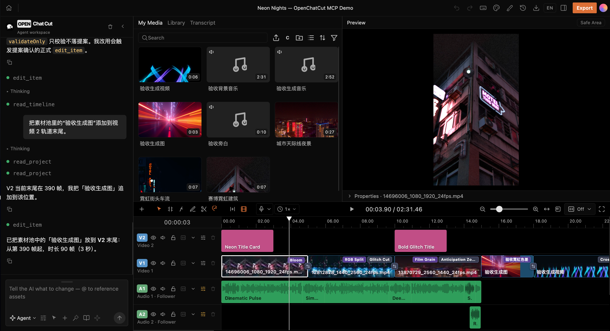
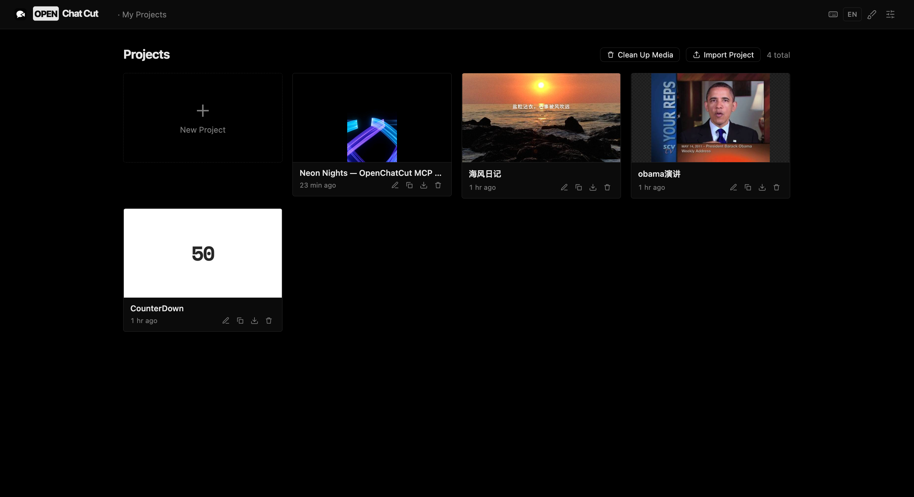
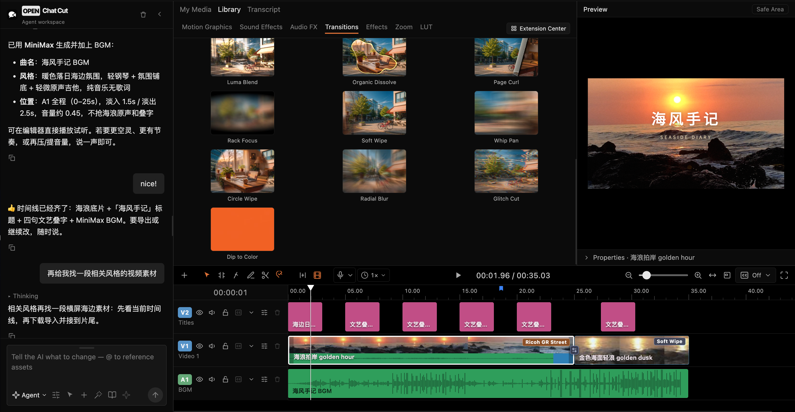
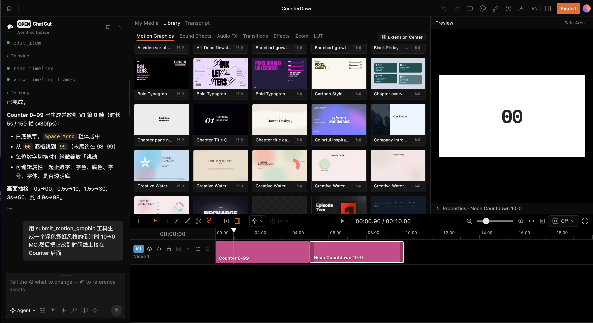
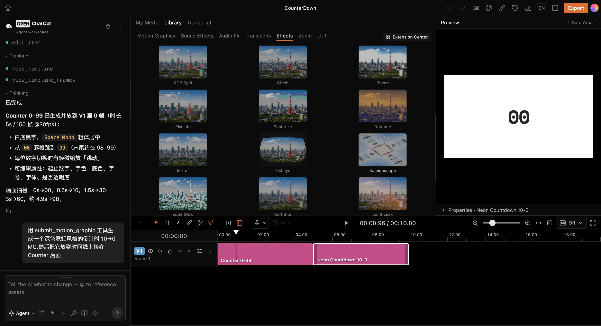
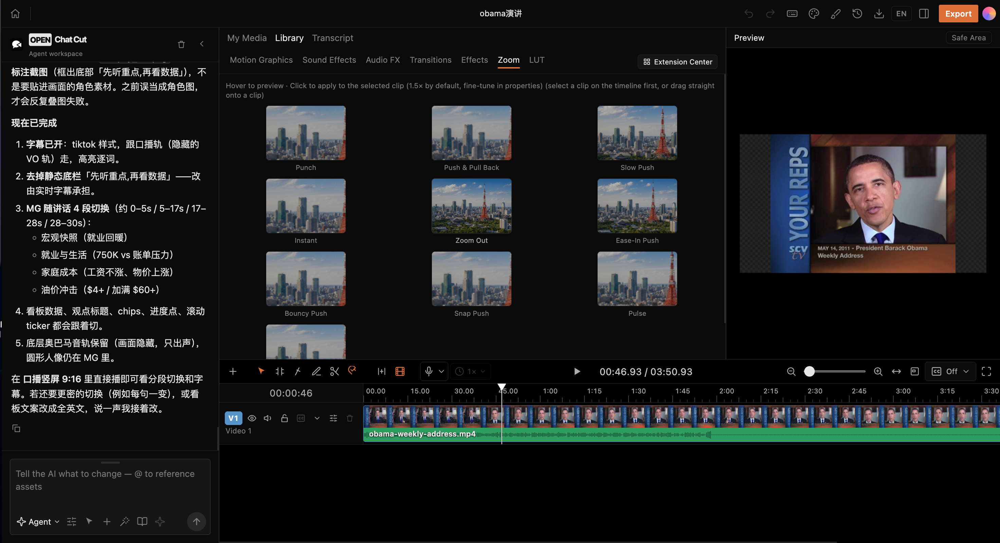
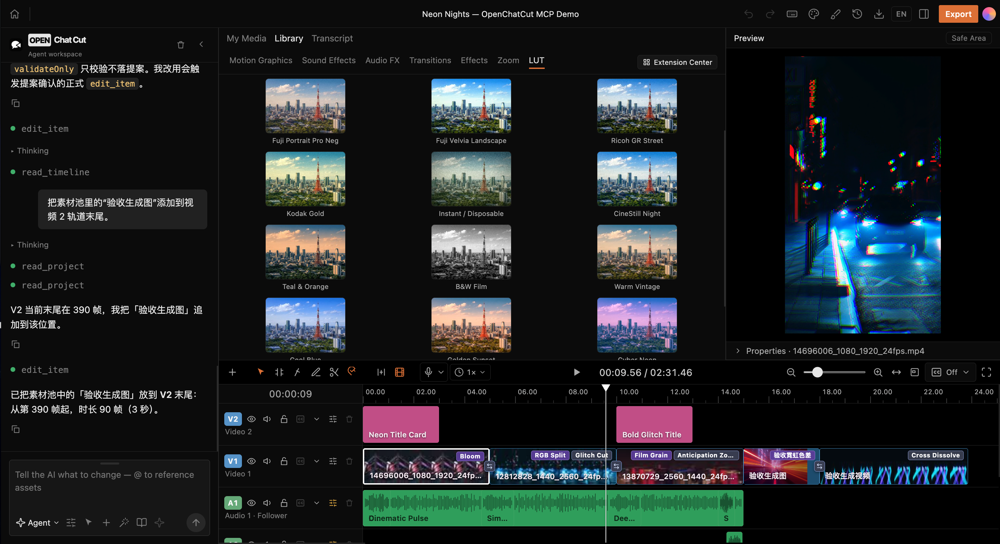

<p align="center">
  
</p>

<h1 align="center">OpenChatCut</h1>

<p align="center">
  <strong>简体中文</strong> · <a href="README.md">English</a>
</p>

<p align="center">
  <strong>开源 ChatCut 替代 · Agent-native · local-first AI 视频编辑器</strong>
</p>

<p align="center">
  让 Codex、Claude Code 和内置 Agent 直接读取、剪辑并导出可继续编辑的真实视频工程。
  官网：<a href="https://openchatcut.com">openchatcut.com</a>
</p>

<p align="center">
  <a href="#openchatcut-是什么">产品介绍</a> ·
  <a href="#产品导览">产品导览</a> ·
  <a href="#快速开始">快速开始</a> ·
  <a href="#在-codex--claude-code-中使用">Agent / MCP</a> ·
  <a href="#更新日志">更新日志</a> ·
  <a href="#star-趋势">Star 趋势</a> ·
  <a href="#贡献">参与贡献</a>
</p>

<p align="center">
  <a href="https://github.com/0xsline/OpenChatCut"></a>
  <a href="https://discord.gg/JActyWMjms"></a>
  
  
  
  
  
  
  
</p>

<p align="center">
  <a href="https://www.producthunt.com/products/openchatcut?embed=true&amp;utm_source=badge-featured&amp;utm_medium=badge&amp;utm_campaign=badge-openchatcut" target="_blank" rel="noopener noreferrer"></a>
</p>

<p align="center">
  
</p>

<p align="center">
  <sub>从一句话到真实时间线：Agent、素材、预览、动态图形、转场、特效与多轨音频在同一个工程中协作。</sub>
</p>

---

## OpenChatCut 是什么

OpenChatCut 是 **开源 ChatCut 替代方案**：把 **对话式 Agent** 和 **专业时间线编辑** 放在同一工作区的 AI 视频编辑器。独立开源（AGPL），与商业版 ChatCut 无隶属关系。

**OpenChatCut = 本地视频工程 + 多轨时间线 + AI Agent + MCP + 可交付导出。**

它不是只生成一段不可修改的视频。每次编辑都会落到真实工程中的轨道、片段、转场、字幕、特效和素材上；你可以继续手动调整，也可以撤销、重做、保存版本或交给另一个 Agent 接着完成。

它适合希望让 AI 真正参与剪辑流程、同时保留专业编辑控制权的创作者和开发者，而不是每次都从一个空白聊天框或不可修改的生成结果重新开始。

- 官网：[https://openchatcut.com](https://openchatcut.com)
- 开源 ChatCut 替代说明：[https://openchatcut.com/zh/blog/open-source-chatcut-alternative](https://openchatcut.com/zh/blog/open-source-chatcut-alternative)
- ChatCut 与 OpenChatCut 对比：[https://openchatcut.com/zh/blog/chatcut-vs-openchatcut](https://openchatcut.com/zh/blog/chatcut-vs-openchatcut)

- 🤖 **Agent-native**：内置 Agent 与外部 MCP Agent 共用同一套编辑工具。
- 🎞️ **真实时间线**：多视频轨、多音频轨、转场、特效、LUT、缩放和关键帧。
- 📝 **文字稿驱动**：词级转写、删词剪辑、停顿处理、说话人和字幕联动。
- ✨ **生成与素材**：图片、视频、语音、音乐、音效及在线素材检索。
- 🧩 **MG 与 WebGL**：动态图形模板、自定义 shader、视觉特效和转场。
- 📦 **可交付导出**：MP4、音频、字幕、FCPXML 和工程数据。
- 🖥️ **Local-first**：工程和素材优先保存在本机，密钥只进入服务端。

---

## 产品导览

下面均为 OpenChatCut 中的真实工程与编辑状态，而不是静态界面稿。

<table>
  <tr>
    <td width="50%" valign="top" align="center">
      <br />
      <sub><b>本地工程管理</b> — 创建、导入、复制、导出并继续编辑多个真实工程。</sub>
    </td>
    <td width="50%" valign="top" align="center">
      <br />
      <sub><b>Agent 驱动的完整剪辑</b> — 生成音乐、调用工具并把转场、字幕与多轨素材写入时间线。</sub>
    </td>
  </tr>
  <tr>
    <td width="50%" valign="top" align="center">
      <br />
      <sub><b>Motion Graphics 与 Agent</b> — 浏览动态图形模板，也可以让 Agent 生成并组合可继续编辑的 MG 片段。</sub>
    </td>
    <td width="50%" valign="top" align="center">
      <br />
      <sub><b>WebGL 视觉特效</b> — 像素化、双色调、鱼眼、万花筒、柔化与漏光等效果可直接应用到片段。</sub>
    </td>
  </tr>
  <tr>
    <td width="50%" valign="top" align="center">
      <br />
      <sub><b>镜头运动与缩放</b> — 推拉、慢推、快速缩放和缓动镜头效果与时间线协同工作。</sub>
    </td>
    <td width="50%" valign="top" align="center">
      <br />
      <sub><b>LUT 与色彩风格</b> — 使用统一参考画面实时比较相机转换与胶片风格。</sub>
    </td>
  </tr>
</table>

---

## 为什么是 OpenChatCut

传统编辑器擅长精细操作，一次性 AI 生成器擅长快速出片。OpenChatCut 把两者连成同一个可持续编辑的工程：

| 能力 | 传统时间线编辑器 | 一次性 AI 视频生成 | **OpenChatCut** |
|---|:---:|:---:|:---:|
| 精确到轨道和片段 | ✅ | ❌ | **✅** |
| 自然语言修改工程 | ❌ | ✅ | **✅** |
| 修改可检查、可撤销 | ✅ | 通常不可 | **✅** |
| 文字稿与画面联动 | 部分支持 | ❌ | **✅** |
| Codex / Claude Code 直接操作 | ❌ | ❌ | **✅ MCP** |
| 内置 Agent 与外部 Agent 协作 | ❌ | ❌ | **✅ 同一工具面** |
| 本地工程与 BYOK | 视产品而定 | 通常云端 | **✅** |

核心编辑循环：

```text
描述目标 → Agent 读取工程 → 生成可验证编辑 → 写入时间线
         → 预览 / 调整 / 撤销 → 字幕与混音 → 导出
```

---

## 核心能力

| 领域 | 已实现能力 |
|---|---|
| 时间线 | 多轨、移动、裁剪、切分、波纹编辑、吸附、关键帧、标记、撤销与重做 |
| 视觉 | WebGL 特效、LUT、色度键、缩放、转场、自定义 shader |
| 音频 | 多音轨、音效、背景音乐、旁白录制、响度、自动闪避、人声隔离 |
| 文字稿 | 转写任务、词级编辑、停顿压缩、查找、说话人和片段视图 |
| 字幕 | 自动字幕、命名样式、翻译、时间线 overlay、SRT 导出 |
| MG | 内置动态图形模板、安全沙箱、自定义模板与视频化 |
| AI 生成 | 图片、视频、语音、音乐和音效任务，支持进度追踪 |
| 素材 | 上传、文件夹、在线图片/视频/音频检索、Firecrawl 视觉素材兜底 |
| 导出 | MP4、音频、字幕、FCPXML、工程导入导出、导出历史、硬件感知的 H.264 加速和资源感知的导出排队 |
| Agent | 内置对话 Agent、技能系统、提案式编辑、外部 Streamable HTTP MCP |

---

## 典型使用场景

- **口播与访谈精剪**：转写音视频，按文字删除口误、停顿和冗余内容，再自动生成字幕。
- **多素材快速成片**：导入视频、图片和音频，让 Agent 完成粗剪、转场、配乐和节奏调整。
- **短视频与社交内容**：重构画幅，生成标题、字幕、旁白、音乐和视觉包装。
- **Motion Graphics**：使用内置模板或让 Agent 生成可继续编辑的动态图形片段。
- **开发者自动化**：通过 MCP 让 Codex、Claude Code 或其他兼容客户端读取并修改真实工程。

## 使用流程

1. 创建工程并导入本地素材。
2. 在时间线上手动剪辑，或直接描述想要的结果。
3. Agent 读取工程上下文并调用编辑工具。
4. 检查提案、预览画面，再应用、调整或撤销。
5. 完成字幕、音频、特效和色彩处理。
6. 导出视频、音频、字幕、FCPXML 或完整工程。

---

## 快速开始

### 桌面安装包

从 [GitHub Releases](https://github.com/0xsline/OpenChatCut/releases/latest) 下载最新的 macOS 与 Windows 构建。目前提供 Apple Silicon、Intel Mac 的 DMG，以及 Windows x64 安装包。

这些仍是早期构建。macOS 安装包尚未签名和公证，首次启动时可能需要在系统设置中手动允许。

### 从源码运行

需要 Node.js 24.x 和 npm。`package.json` 会约束支持的 Node.js 范围，`.nvmrc` 可供 Node 版本管理器直接选择对应主版本。

```bash
git clone https://github.com/0xsline/OpenChatCut.git
cd OpenChatCut
npm install
cp .env.example .env.local
npm run dev
```

打开：

```text
http://localhost:5199
```

`.env.local` 中只需填写你实际使用的模型或素材服务。没有配置的第三方能力会明确提示缺少对应 Key，不影响本地时间线编辑、内置素材和已配置的其他能力。

本地 H.264 导出会在 macOS 上优先使用 VideoToolbox，在兼容的 Windows 设备上优先使用 NVENC，失败时自动回退软件编码。可用 `OPENCHATCUT_RENDER_CONCURRENCY` 和 `OPENCHATCUT_MAX_ACTIVE_EXPORTS` 调整渲染并发及重型导出上限，用 `OPENCHATCUT_DISABLE_HARDWARE_ENCODING` 关闭硬件编码，或用 `OPENCHATCUT_H264_ENCODER` 覆盖 FFmpeg 侧的编码器选择；详见 [`.env.example`](.env.example)。

### 桌面端开发

```bash
npm run desktop:dev
```

桌面端使用 Electron 壳层和同一套内嵌服务，Web 开发版与桌面版共享工程、Agent、生成和导出逻辑。

---

## 项目状态

OpenChatCut 目前处于积极开发阶段，编辑器、工程格式和 Agent 工具仍会持续迭代。预构建的 macOS 与 Windows 安装包已发布到 [GitHub Releases](https://github.com/0xsline/OpenChatCut/releases)；开发和排障时，从源码运行仍是最透明的方式。

基础时间线、本地工程、内置素材和手动编辑不依赖云服务。AI 模型、在线素材、生成、转写等联网能力只在你配置对应服务后启用。

---

## 在 Codex / Claude Code 中使用

OpenChatCut 暴露 Streamable HTTP MCP：

```text
http://localhost:5199/api/external-mcp/mcp
```

仓库根目录的 `.mcp.json` 已包含本地连接。使用时间线工具前，先运行 OpenChatCut 并打开目标工程；工程列表、创建和定位工具不要求编辑器保持打开。

### Codex

在 Codex 配置中加入：

```toml
[mcp_servers.openchatcut]
url = "http://localhost:5199/api/external-mcp/mcp"
```

### Claude Code

```bash
claude mcp add --transport http openchatcut \
  http://localhost:5199/api/external-mcp/mcp
```

然后可以直接对 Agent 描述编辑任务：

```text
读取当前工程，在第二条音频轨的 8 秒处添加划盘音效，
给相邻视频添加故障转场，检查 1、6、11 秒三帧后导出竖屏 MP4。
```

外部 Agent 调用的仍是编辑器内部同一套工具和 `EditorCore` 命令，不存在两套互相漂移的工程格式。

### MCP 访问保护

自行暴露 MCP 入口时可配置：

```bash
OPENCHATCUT_MCP_TOKEN=your-token
OPENCHATCUT_EDITOR_URL=https://your-editor.example.com
```

客户端使用 `Authorization: Bearer <token>`。当前桥接面按单机单用户设计，不作为多租户服务。

---

## 架构

<p align="center">
  
</p>

<p align="center">
  <sub>同一套 Agent 工具和 EditorCore 命令连接内置 Agent、外部 MCP、真实时间线、本地数据与交付导出。</sub>
</p>

| 层 | 技术 |
|---|---|
| 前端 | React 19、TypeScript 6、Vite 8 |
| 编辑核心 | 不可变时间线状态、命令层、提案式应用 |
| Agent | Vercel AI SDK 7（Anthropic、OpenAI、Gemini、Kimi、Qwen、GLM、DeepSeek、MiniMax、Mistral 与兼容接口）、Agent Skills、MCP SDK |
| 预览与视觉 | Remotion Player、WebGL / GLSL |
| 服务端 | Vite / Electron 双宿主插件、服务端密钥仓 |
| 持久化 | `~/.openchatcut` 下的本机共享工程库、IndexedDB 缓存、可配置本地素材目录、可选 Cloudflare R2 |
| 桌面端 | Electron 43 |
| 导出 | Remotion、FFmpeg、FCPXML、SRT |

### 目录速览

| 目录 | 职责 |
|---|---|
| `src/editor/` | 时间线状态与命令，保持 UI 和 LLM 无关 |
| `src/agent/` | Agent 装配、工具、技能、进度和设置 |
| `src/library/` | MG、音效、转场、特效、LUT 等资源库 UI |
| `src/transcript/` | 转写、词级编辑和文字稿 UI |
| `src/captions/` | 字幕模型、样式、控制和预览层 |
| `src/gl/` | WebGL 特效、转场与 shader runtime |
| `src/generate/` | 图片、视频、语音、音乐和音效生成客户端 |
| `src/persist/` | 工程、聊天、版本和媒体持久化 |
| `server/plugins/` | 生成、转写、素材、导出和存储服务 |
| `desktop/` | Electron 主进程与内嵌服务 |
| `remotion/` | 无头渲染和导出管线 |

---

## 数据与隐私

- 工程、聊天记录和版本数据保存在 `~/.openchatcut` 下的本机共享工程库中；IndexedDB 用于浏览器端缓存和旧数据迁移。
- 用户媒体保存在本地素材目录，可自行备份和迁移。
- AI 请求是否离开本机，取决于你配置的模型、生成或素材服务。
- 未配置的云端能力不会影响本地时间线和已有素材编辑。
- 对外开放 MCP 时，应配置 Bearer Token，并限制编辑器入口的网络范围。

---

## 安全模型

- 密钥只进入服务端配置；浏览器端禁止使用 `VITE_` 暴露供应商密钥。
- LLM 输出、插件包、模板代码和用户输入都在信任边界处校验。
- MG 与 shader 代码进入受限沙箱，恶意模板由专门检查脚本拦截。
- Agent 只经 `EditorCore` 命令改工程，编辑可追踪、可撤销。
- MCP 默认绑定本机；公网入口支持 Bearer Token。
- 本地素材目录和 R2 凭据由服务端管理，不写入工程 JSON。

---

## 开发与验证

```bash
# 类型检查与生产构建
npm run build

# 核心回归检查
npm test

# 静态检查
npm run lint

```

修改 Agent、时间线、预览或导出后，至少运行：

```bash
npx tsc --noEmit
npm test
npm run build
```

---

## 技术基础

OpenChatCut 基于以下核心项目与规范构建：

| 项目 / 规范 | 在 OpenChatCut 中的作用 |
|---|---|
| [ChatCut-Inc/agent-plugin](https://github.com/ChatCut-Inc/agent-plugin) | Agent Skills 的改造基础。OpenChatCut 基于该插件的技能结构与工作流，针对本地编辑器、存储、MCP 和工具架构进行了适配。详见 [Agent Skills 来源说明](src/agent/skills/NOTICE.md)。 |
| [Remotion](https://www.remotion.dev/) | React 视频预览、合成与服务端渲染的核心基础。 |
| [Model Context Protocol](https://modelcontextprotocol.io/) | Codex、Claude Code 等外部 Agent 访问工程与时间线工具的协议基础。 |
| [Vercel AI SDK](https://ai-sdk.dev/) | 内置 Agent 的多厂商模型流式响应与工具调用基础。 |
| [tt-a1i/archify](https://github.com/tt-a1i/archify) | README 运行时架构图的定义、校验与 SVG 生成工具。 |

这里列出的是项目的主要技术基础，不替代各依赖、字体和内置二进制随附的许可证。完整 JavaScript 依赖版本见 `package-lock.json`，字体授权见 [`assets/fonts/LICENSES.md`](assets/fonts/LICENSES.md)。

---

## 更新日志

重要变更见中英双语的 [`CHANGELOG.md`](CHANGELOG.md)，所有已发布安装包与源码包见 [GitHub Releases](https://github.com/0xsline/OpenChatCut/releases)。

---

## Star 趋势

<p align="center">
  <a href="https://www.star-history.com/?type=date&repos=0xsline%2FOpenChatCut">
    <picture>
      <source media="(prefers-color-scheme: dark)" srcset="https://api.star-history.com/chart?repos=0xsline/OpenChatCut&type=date&theme=dark&legend=top-left&sealed_token=KKfeYtGGCjyG1QN9_Ev6Tvyyrcp5LW6bzOT8ZKED1EE0qNRqM3KrThzzbXWdcP6K-sr3vKbmoFZYDviSMtf8SI5UqAPYQf9v8qXCpM04S2C4LQTAKPbexT66SI3Q8pcHJJoMT7VCZnGp93LqIXZchAyYfTMmKy_y_LFOJ-_ruEq8GP1kVESXshaFzJfC" />
      <source media="(prefers-color-scheme: light)" srcset="https://api.star-history.com/chart?repos=0xsline/OpenChatCut&type=date&legend=top-left&sealed_token=KKfeYtGGCjyG1QN9_Ev6Tvyyrcp5LW6bzOT8ZKED1EE0qNRqM3KrThzzbXWdcP6K-sr3vKbmoFZYDviSMtf8SI5UqAPYQf9v8qXCpM04S2C4LQTAKPbexT66SI3Q8pcHJJoMT7VCZnGp93LqIXZchAyYfTMmKy_y_LFOJ-_ruEq8GP1kVESXshaFzJfC" />
      
    </picture>
  </a>
</p>

---

## 许可证

OpenChatCut 采用 [GNU Affero General Public License v3.0 或更高版本](LICENSE)。
第三方组件与资产仍分别受其自身许可证约束。

---

## 贡献

1. 从 `main` 创建分支。
2. 非平凡逻辑附带一个可运行检查。
3. 提交前运行 `npm test`、`npm run lint` 和 `npm run build`。
4. 发起 Pull Request，并附上涉及 UI 或视频行为的截图/验收证据。

问题与功能建议请使用 [GitHub Issues](https://github.com/0xsline/OpenChatCut/issues)。
